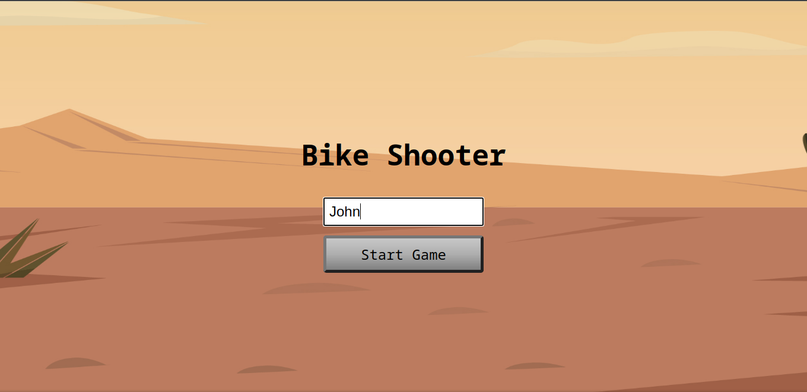
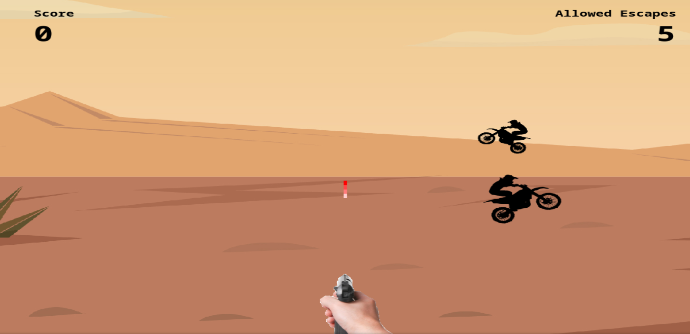
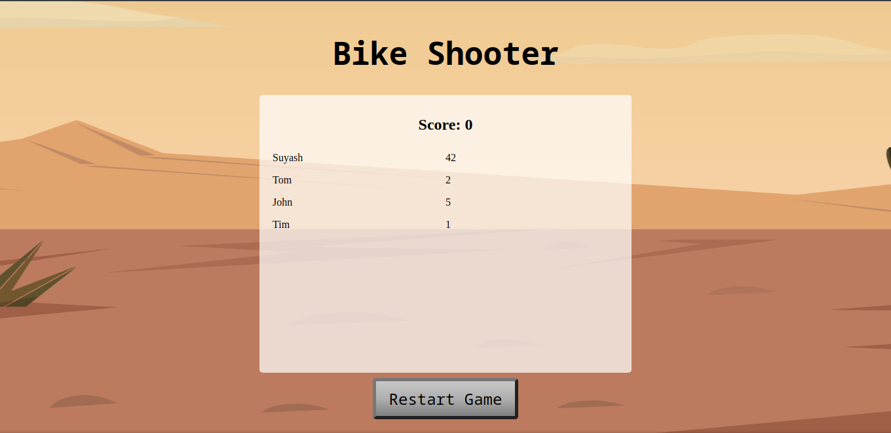

# Bike Shooter

> Bike Shooter is an action pack shooting game with bikes.

## Story

You are a lonely person peacefully living in the desert, far from the noise of the city. And some Mafia starts disturbing your peace of mind with their bike.

What they are not aware of is that you are a bigger Mafia than them. So you take out your exploding bullet gun and start shooting them one by one. And to keep your self-respect, you wouldn't allow more than 5 of them to leave alive.

But stay alert, their bikes are also equipped with exploding bullet guns. They can shoot you anytime, so you have to keep avoiding their bullets too.

## Screenshot

### Start

### Game

### End

## Live Demo Link

https://krishnzzz.github.io/bike-shooter/

## How to setup on pc
- Clone the project by running `git clone https://github.com/krishnzzz/bike-shooter.git` on terminal or CMD
- Make sure you have NodeJS and NPM installed on your PC.
- Run terminal or CMD from the project directory.
- Run `npm install` in terminal or CMD to install all required packages for the proper running of the game.
- Install and set up a local server.
- One local server example could be by running `npm i -g live-server` on terminal or CMD.
- Having live-server install, run `live-server` on terminal or CMD from the dist directory in the project folder.
- The game will then automatically open in your web browser.

## How to play

- First input your name in the textbox that appears in the middle of the screen.
- Then press start.
- Move your hand by using arrow buttons from your keyboard.
- Press the spacebar to shoot.
- Make sure to neither let 5 bikers leave alive nor let anyone shoot you.
- Try to shoot as much as biker possible to get the highest score.

## Built With

- HTML 
- CSS
- Linter
- JS
- Webpack
- VScode
- Phaser

## References

- Gun

Image from [Deposit Photos](https://st.depositphotos.com/1001286/2640/i/950/depositphotos_26405849-stock-photo-aiming-male-hand-keeps-gun.jpg)

Sound from [YouTube.com](https://www.youtube.com/watch?v=Obk95vM8Gtc)

- Desert Background

Image from [Vecteezy.com](https://www.vecteezy.com/vector-art/224422-vector-desert-landscape-illustration)

- Bike

Image from [Hiclipart.com](https://www.hiclipart.com/free-transparent-background-png-clipart-pxzuf)

Sound from [YouTube.com](https://www.youtube.com/watch?v=vly-Eho_ReE)

## Contributing

Contributions, issues and feature requests are welcome! Start by:

  - Forking the project
  - Cloning the project to your local machine
  - cd into the project directory
  - Run git checkout -b your-branch-name
  - Make your contributions
  - Push your branch up to your forked repository
  - Open a Pull Request with a detailed description to the development branch of the original project for a review

## Author

👤 Suyash Fowdar
- Github: [@Krishnzzz](https://github.com/krishnzzz)
- Twitter: [@twitterhandle](https://twitter.com/Krishnzzz)
- LinkedIn: [LinkedIn](https://www.linkedin.com/in/suyash-fowdar-22b89514a/)

## Show your Support
Give a ⭐ if you like this project!
